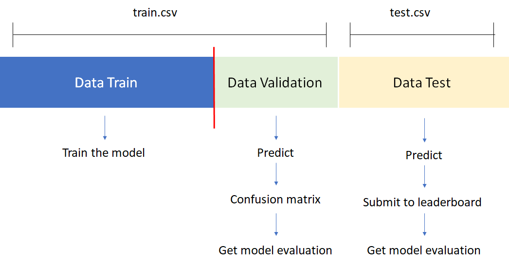

```{r setup, include=FALSE}
knitr::opts_chunk$set(echo = TRUE)
```

# Introduction {#intro}

## Background

This article aims to accomplish [Machine Learning Specialization Capstone Project](https://algorit.ma/machine-learning-specialization/) course at Algoritma. The dataset used is specially obtained from [here](https://rpubs.com/AlgoritmaAcademy/ml-capstone). You could see the source code fully in my GitHub account [here](https://github.com/utomoreza/FnB).

All dataset used in capstone could be found in this [link](https://drive.google.com/drive/folders/18czGYmVyAngP1OmxUquGOWkOJldc1Y6B?usp=sharing). In the link, it is provided for each case 2 datasets: train and test dataset.

The train dataset will be used to train and evaluate the model, while the test dataset is used as the final evaluation and requires you to submit the prediction to the [leaderboard](https://algoritma.shinyapps.io/leaderboard_capsml/) in order to obtain the model evaluation. The data scheme is illustrated as follows:



## Content {#content}

The Food and Beverage dataset is provided by Dattabot, which contains detailed transaction of multiple food and beverage outlets. Using this dataset, we are challenged to do some forecasting and time series analysis to help the outlet’s owner making a better business decision.

Customer behaviour, especially in food and beverage industry, is highly related to seasonality patterns. The owner wants to analyze the number of visitors so he could make better judgement in 2018. Fortunately, we already know that time series analysis is enough to provide a good forecast and seasonality explanation.

The dataset includes information about:

+ `transaction_date`: The timestamp of a transaction
+ `receipt_number`: The ID of a transaction
+ `item_id`: The ID of an item in a transaction
+ `item_group`: The group ID of an item in a transaction
+ `item_major_group`: The major-group ID of an item in a transaction
+ `quantity`: The quantity of purchased item
+ `price_usd`: The price of purchased item
+ `total_usd`: The total price of purchased item
+ `payment_type`: The payment method
+ `sales_type`: The sales method

## Aim {#aim}

Here, we are asked to make a report of forecasting result and seasonality explanation for hourly number of visitors, that would be evaluated on the next 7 days (Monday, 19 December 2017 to Sunday, 25 December 2017).

## Objectives

+ To aggregate the dataset in order to obtain `visitor` feature.
+ To round `time` feature in respective hour.
+ To perform time series padding for incomplete time series.
+ To replace missing values in time series with more meaningful values.
+ To create time series object.
+ To decompose the time series object into trend, sesonality, and residual.
+ To visualize the observed seasonality.
+ To interpret the observed seasonality.
+ To examine assumption checking, i.e. autocorrelation, normality, and stationarity.
+ To perform cross validation of the train dataset.
+ To model the time series object and perform model fitting.
+ To evaluate the model and vizualize it.
+ To compare several models.
+ To reach MAE (Mean Absolute Error) less than 6 in validation dataset.
+ To forecast the test dataset using the final model.
+ To reach MAE less than 6 in test dataset.

## Structure

This article is arranged as follows.

1. [Introduction](#intro)
2. [Preparation](#prepar)
3. [Exploratory Data Analysis](#eda)
4. [Preprocessing](#preproc)
5. [Modelling and Evaluation](#model)
6. [Model Tuning](#tuning)
7. [Final Model](#final)
8. [Conclusions](#concl)

# Preparation {#prep}

Load all necessary packages.

```{r message=FALSE}
library(tidyverse) # to ease data cleansing, use ggplot
library(ggfortify) # to assist ggplot in plotting time series object
library(lubridate) # to process datetime variables
library(forecast) # to perform time series modelling
library(MLmetrics) # to evaluate the models using MAE
library(TSstudio) # to plot the forecasted results
library(tseries) # to use adf.test (staionarity test)
```

Load the train dataset and view its first five rows.

```{r}
fnb <- read.csv("data/data-train.csv")
head(fnb)
str(fnb)
```

As stated earlier in the [Aim](#aim) section above, we're going to perform time series analysis. Therefore, looking at above data frame, we can see there are many unnecessary features. For time series, we're only interested in two features, i.e. time and the feature in forecasting question (which is visitor).

However, the data frame above does not have the visitor feature we need. Thus, we have to create it ourselves. From all variables available in the data frame, we can see `transaction_date` contains date-time values that we're going to use it as date-time feature. However, to find good feature candidate for visitor feature, we have to carefully look again to and read the [Content](#content) section. There, we can see that `receipt_number` could be a good candidate as it represents the ID of every single transaction. And every transaction means every customer. If we accurately look at the data frame, each `item_id` could have the same `receipt_number` as other `item_id`. Since `item_id` represents The ID of an item in a transaction, it is clear that every `receipt_number` could have more than one items or `item_id`. In other words, every customer **or visitor** can order more than one food and/or drink. Therefore, we agree to select `receipt_number` as the candidate to create `visitor` feature.

Now, let's drop all unnecessary variables, except `transaction_date` and `receipt_number`.
Next, since the `transaction_date` column is not in correct data type as shown by `str()` function above, we need to change its data type to date-time by using `ymd_hms()` function from the `lubridate` library.

```{r}
fnb <- fnb %>% select(transaction_date, receipt_number)
fnb$transaction_date <- ymd_hms(fnb$transaction_date)
head(fnb)
```

We've obtained necessary columns. If we show their first 6 rows, all date-time values have values until minutes and seconds. We need to round them in their hour in order to facilitate us in counting the visitors for each hour. We can use the `floor_date` function from `lubridate` and set the unit parameter to `"hour"` as we want to round them in hour. Afterwards, we can group all rows in the `transaction_date` column in order to count the number of unique `receipt_number` (since every single `receipt_number` means every single visitor). From such counted values, we can create a new column called `visitor`.

```{r}
fnb <- fnb %>% 
  mutate(transaction_date = floor_date(x = .$transaction_date, unit = "hour")) %>% 
  group_by(transaction_date) %>% 
  summarise(visitor = n_distinct(receipt_number)) %>% 
  ungroup()
fnb
```

Next, if we look at the data frame above, the `transaction_date` column does not have full 24 hours time series. From the beginning of hour `13:00:00`, its irregularity starts. Sometimes, the hour of a day begins at 10 AM, 9 AM, or 1 PM. Hence, we have to solve this irregularity by unifying every single day with 24 hours, i.e. every single day starting at 0 AM and ending at 23 PM. This is called time series padding. We can do this by using the `pad` function from the `padr` library as shown below.

```{r}
min_date <- min(fnb$transaction_date) # define the last date
max_date <- max(fnb$transaction_date) # define the first date

# we make the first date-time value. Since the min_date contains hour value in 1 PM, we dont want this so that we have to create an hour of "00:00:00"
start_val <- make_datetime(year = year(min_date), month = month(min_date), day = day(min_date), hour = hour(hms("00:00:00")))

# we make the last date-time value
end_val <- make_datetime(year = year(max_date), month = month(max_date), day = day(max_date), hour = hour(max_date))

# we perform time series padding and assign the results in a new variable called fnb_pad
fnb_pad <- padr::pad(x = fnb, start_val = start_val, end_val = end_val)

# show the data frame
fnb_pad
```

From the data frame shown above, we can see a lot of missing values. To see them clearly, let's count them.

```{r}
is.na(fnb_pad) %>% colSums()
```

There are 676 missing values in the `visitor` column. This is unsurprised results as we have carried out time series padding, then the blank rows in `visitor` columns are filled with missing values. We need this missing values because basically this represents the absence of visitor, namely 0 visitor. Therefore, instead of filling with NAs, we'd like to fill such missing values with 0 value.

```{r}
fnb_pad$visitor <- replace_na(fnb_pad$visitor, 0)
fnb_pad
```


```{r}
fnb_pad$date <- ymd(paste(year(fnb_pad$transaction_date),
                      month(fnb_pad$transaction_date), 
                      day(fnb_pad$transaction_date), 
                      sep = "-"))
fnb_pad$time <- hms(paste(hour(fnb_pad$transaction_date), 0, 0, sep = ":"))

fnb_pad$day <- wday(x = fnb_pad$transaction_date, label = T, abbr = F)
```

```{r}
fnb_pad %>% ggplot(aes(x = hour(time), y = visitor)) +
  geom_col(aes(fill = day)) +
  theme_minimal() +
  labs(title = "Number of visitors",
       x = "Hour",
       y = "Number of visitors",
       fill = "Day")
```

# Modelling

```{r}
fnb_ts <- ts(data = fnb_pad$visitor, frequency = 24*7)
autoplot(fnb_ts)
```

```{r}
fnb_dec <- decompose(x = fnb_ts, type = "additive")
fnb_dec %>% autoplot()
```

```{r}
hist(fnb_dec$random)
shapiro.test(fnb_dec$random)
```

```{r}
Box.test(fnb_dec$random)
```

```{r}
tseries::adf.test(x = fnb_ts)
```

```{r}
# split train-validation 1 seasonal
train <- head(fnb_ts, length(fnb_ts) - 24 * 7)
validation <- tail(fnb_ts, 24 * 7)
```

```{r}
model_holt<- HoltWinters(train, seasonal = "additive")
forecast_holt <- forecast::forecast(model_holt, h = 24 * 7)
MLmetrics::MAE(y_pred = forecast_holt$mean, y_true = validation)
TSstudio::plot_forecast(forecast_holt) #, title = "Model Complex Seasonality")
```

```{r}
TSstudio::test_forecast(actual = fnb_ts, forecast.obj = forecast_holt,
                        train = train, test = validation)
```

```{r}
model_arima <- forecast::auto.arima(train)
forecast_arima <- forecast::forecast(model_arima, h = length(validation))
TSstudio::plot_forecast(forecast_arima)
MLmetrics::MAE(y_pred = forecast_arima$mean, y_true = validation)

# ARIMA(2,0,2)(0,1,0)[168]
```

```{r}
TSstudio::test_forecast(actual = fnb_ts, forecast.obj = forecast_arima,
                        train = train, test = validation)
```

```{r}
summary(model_arima)
```

```{r}
model_arimaTuned <- arima(train, order = c(2,0,2),
                       seasonal = list(order = c(0,1,0), period = 24),
                       method = "ML")
forecast_arimaTuned <- forecast::forecast(model_arimaTuned, h = length(validation))
TSstudio::plot_forecast(forecast_arimaTuned)
MLmetrics::MAE(y_pred = forecast_arimaTuned$mean, y_true = validation)
```

```{r}
TSstudio::test_forecast(actual = fnb_ts, forecast.obj = forecast_arimaTuned,
                        train = train, test = validation)
```


```{r}
forecast::msts(data = fnb_pad$visitor, seasonal.periods = c(24, 24*7)) %>% 
  forecast::mstl() %>% 
  autoplot()

fnb_msts <- forecast::msts(data = fnb_pad$visitor, seasonal.periods = c(24, 24*7))
```

```{r}
# split train-validation 2 seasonal
train_2 <- head(fnb_msts, length(fnb_msts) - 24 * 7)
validation_2 <- tail(fnb_msts, 24 * 7)
```

```{r}
model_holt_msts<- HoltWinters(train_2)
forecast_holt2 <- forecast::forecast(model_holt_msts, h = 24 * 7)
MLmetrics::MAE(y_pred = forecast_holt2$mean, y_true = validation_2)
TSstudio::plot_forecast(forecast_holt2)
```

```{r}
forecast_holt2$mean %>% autoplot(color = "blue") + 
  autolayer(validation_2, color = "green")
```

```{r}
TSstudio::test_forecast(actual = fnb_msts, forecast.obj = forecast_holt2,
                        train = train_2, test = validation_2)
```

```{r}
forecast::tsdisplay(fnb_msts, lag.max = 170)
```

```{r}
arima(x = fnb_msts, order = c())
```

###### Test dataset using one seasonal

```{r}
fnb_test <- read.csv("data/data-test.csv")


model_ready <- HoltWinters(fnb_ts, seasonal = "additive")
forecast_test <- forecast::forecast(model_ready, h = 24*7)

OpenTimeIdx <- grep("^10$", (rep(0:23, 7)))
CloseTimeIdx <- grep("^22$", (rep(0:23, 7)))

testOutput <- forecast_test$mean[c(OpenTimeIdx[1]:CloseTimeIdx[1],
  OpenTimeIdx[2]:CloseTimeIdx[2],
  OpenTimeIdx[3]:CloseTimeIdx[3],
  OpenTimeIdx[4]:CloseTimeIdx[4],
  OpenTimeIdx[5]:CloseTimeIdx[5],
  OpenTimeIdx[6]:CloseTimeIdx[6],
  OpenTimeIdx[7]:CloseTimeIdx[7])]

fnb_test$visitor <- testOutput
write.csv(fnb_test, file = "data/testOutput.csv")
```

```{r}

```

################## test dataset using 2 seasonal

```{r}
model_ready <- HoltWinters(fnb_msts)
forecast_test <- forecast::forecast(model_ready, h = 24*7)

OpenTimeIdx <- grep("^10$", (rep(0:23, 7)))
CloseTimeIdx <- grep("^22$", (rep(0:23, 7)))

testOutput <- forecast_test$mean[c(OpenTimeIdx[1]:CloseTimeIdx[1],
  OpenTimeIdx[2]:CloseTimeIdx[2],
  OpenTimeIdx[3]:CloseTimeIdx[3],
  OpenTimeIdx[4]:CloseTimeIdx[4],
  OpenTimeIdx[5]:CloseTimeIdx[5],
  OpenTimeIdx[6]:CloseTimeIdx[6],
  OpenTimeIdx[7]:CloseTimeIdx[7])]

fnb_test$visitor <- testOutput
write.csv(fnb_test, file = "data/testOutput2Season.csv")
```

```{r}
model_ready <- forecast::auto.arima(fnb_msts)
forecast_test <- forecast::forecast(model_ready, h = 24*7)
modelSarimaTest <- model_ready

testOutput <- forecast_test$mean[c(OpenTimeIdx[1]:CloseTimeIdx[1],
  OpenTimeIdx[2]:CloseTimeIdx[2],
  OpenTimeIdx[3]:CloseTimeIdx[3],
  OpenTimeIdx[4]:CloseTimeIdx[4],
  OpenTimeIdx[5]:CloseTimeIdx[5],
  OpenTimeIdx[6]:CloseTimeIdx[6],
  OpenTimeIdx[7]:CloseTimeIdx[7])]

fnb_test$visitor <- testOutput
write.csv(fnb_test, file = "data/testOutputSarima.csv")
```

```{r}
summary(modelSarimaTest)
```

################

```{r}
OpenTimeIdx <- grep("^10$", (rep(0:23, 7)))
CloseTimeIdx <- grep("^22$", (rep(0:23, 7)))
```


################

```{r}
one <- read.csv("data/testOutput.csv")
two <- read.csv("data/testOutput2Season.csv")
three <- read.csv("data/testOutputArima.csv")
four <- read.csv("data/testOutputTBATS.csv")

p1 <- data.frame(datetime = ymd_hms(one$datetime), cbind(one = one$visitor, two = two$visitor, three = three$visitor, four = four$visitor)) %>% 
  ggplot(aes(datetime)) +
  geom_line(aes(y = one), color = "blue") +
  geom_line(aes(y = two), color = "red") +
  geom_line(aes(y = three), color = "green") +
  geom_line(aes(y = four), color = "black")

plotly::ggplotly(p1)
```

##################

```{r}
tbats_mod <- fnb_msts %>%
            forecast::tbats(use.box.cox = FALSE, 
                            use.trend = TRUE, 
                            use.damped.trend = TRUE)
tbats_fore <-  forecast::forecast(tbats_mod,h=24*7)

testOutput <- tbats_fore$mean[c(OpenTimeIdx[1]:CloseTimeIdx[1],
  OpenTimeIdx[2]:CloseTimeIdx[2],
  OpenTimeIdx[3]:CloseTimeIdx[3],
  OpenTimeIdx[4]:CloseTimeIdx[4],
  OpenTimeIdx[5]:CloseTimeIdx[5],
  OpenTimeIdx[6]:CloseTimeIdx[6],
  OpenTimeIdx[7]:CloseTimeIdx[7])]

fnb_test$visitor <- testOutput
write.csv(fnb_test, file = "data/testOutputTBATS.csv")
```


